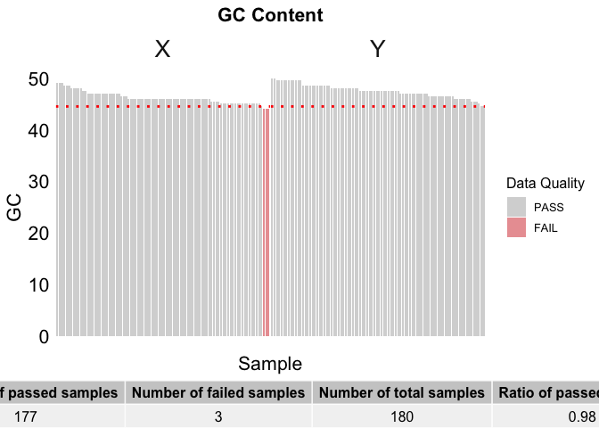
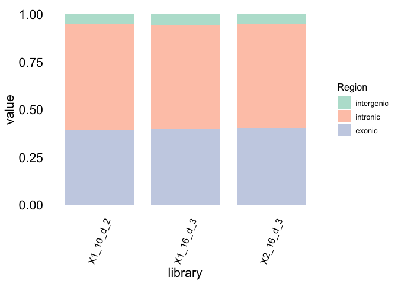

<!-- README.md is generated from README.Rmd. Please edit that file -->

# RawdataQC

<!-- badges: start -->

<!-- badges: end -->

整理转录组测序原始和比对数据的质量控制参数结果，并实现可视化展示。

## Installation

安装R包：

``` r
# install.packages("devtools")
devtools::install_github("lizhihui1996/RawdataQC")
```

## Example

加载R包：

``` r
library(RawdataQC)
#> Loading required package: gridExtra
#> Loading required package: data.table
#> Loading required package: ggsci
#> Loading required package: ggthemes
#> Loading required package: ggplot2
## basic example code
```

``` r
summary(QC)
#>    library             batch            total_reads         gc_content   
#>  Length:180         Length:180         Min.   :31364100   Min.   :44.00  
#>  Class :character   Class :character   1st Qu.:36292119   1st Qu.:46.00  
#>  Mode  :character   Mode  :character   Median :39587210   Median :47.00  
#>                                        Mean   :40533170   Mean   :46.87  
#>                                        3rd Qu.:43738466   3rd Qu.:48.00  
#>                                        Max.   :56719228   Max.   :50.00  
#>     q30_rate        human_rate      rRNA_rate       contamination_rate
#>  Min.   :0.9186   Min.   :97.86   Min.   :0.00000   Min.   :0.2700    
#>  1st Qu.:0.9438   1st Qu.:98.48   1st Qu.:0.01000   1st Qu.:0.3500    
#>  Median :0.9461   Median :98.74   Median :0.03500   Median :0.4025    
#>  Mean   :0.9457   Mean   :98.67   Mean   :0.07522   Mean   :0.5122    
#>  3rd Qu.:0.9484   3rd Qu.:98.86   3rd Qu.:0.12625   3rd Qu.:0.6250    
#>  Max.   :0.9535   Max.   :99.19   Max.   :0.47500   Max.   :1.1300    
#>    error_rate           bias         insertsize        exonic      
#>  Min.   :0.00000   Min.   :0.910   Min.   :263.0   Min.   :0.3959  
#>  1st Qu.:0.01000   1st Qu.:0.980   1st Qu.:284.8   1st Qu.:0.4293  
#>  Median :0.01000   Median :1.010   Median :290.0   Median :0.4456  
#>  Mean   :0.01006   Mean   :1.009   Mean   :290.8   Mean   :0.4446  
#>  3rd Qu.:0.01000   3rd Qu.:1.030   3rd Qu.:297.0   3rd Qu.:0.4602  
#>  Max.   :0.02000   Max.   :1.130   Max.   :314.0   Max.   :0.4944  
#>     intronic        intergenic          type          
#>  Min.   :0.4550   Min.   :0.04404   Length:180        
#>  1st Qu.:0.4843   1st Qu.:0.05073   Class :character  
#>  Median :0.4982   Median :0.05410   Mode  :character  
#>  Mean   :0.5012   Mean   :0.05427                     
#>  3rd Qu.:0.5171   3rd Qu.:0.05672                     
#>  Max.   :0.5503   Max.   :0.06865
```

结果示例:



    #> TableGrob (2 x 1) "arrange": 2 grobs
    #>   z     cells    name               grob
    #> 1 1 (1-1,1-1) arrange     gtable[layout]
    #> 2 2 (2-2,1-1) arrange gtable[colhead-fg]
    #>   Number of passed samples Number of failed samples Number of total samples
    #> 1                      177                        3                     180
    #>   Ratio of passed samples
    #> 1                    0.98



    #>     library exonic intronic intergenic
    #> 1 X1_10_d_2  0.396    0.550      0.054
    #> 2 X1_16_d_3  0.398    0.548      0.054
    #> 3 X2_16_d_3  0.400    0.550      0.050
